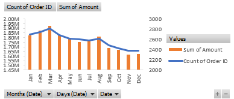
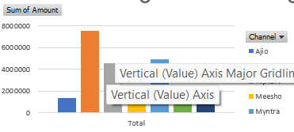
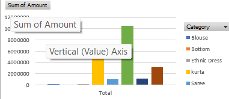

# Super Market Data Analysis 

Description : 
The "Supermarket Sales Analysis" project was initiated with the aim of providing actionable insights to aid the store in crafting an annual sales report, understanding customer behavior, and ultimately boosting sales figures. Through a multifaceted approach encompassing data comprehension, thorough data cleaning, intricate data processing, detailed analysis, compelling visualization, and the creation of a comprehensive report, we delved deep into the intricacies of the supermarket's sales data.

At the outset, we embarked on a journey to unravel the nuances of the dataset, meticulously ensuring its integrity through rigorous data cleaning procedures. Subsequently, employing advanced data processing techniques, we transformed the raw data into a structured format conducive to thorough analysis.

Our analysis spanned a multitude of dimensions, ranging from dissecting sales trends over various timeframes to dissecting product performance and even segmenting customers based on demographic attributes and purchasing habits. Moreover, we unearthed compelling correlations between diverse variables that exerted influence on sales dynamics.

Leveraging an array of visualization techniques, we endeavored to breathe life into our findings, presenting them in visually captivating formats. Through the strategic use of charts, graphs, and diagrams, we elucidated sales patterns, spotlighted top-performing products, delineated customer segments, and illustrated correlations between key metrics.

The culmination of our efforts materialized in the form of a comprehensive report, meticulously crafted to distill our findings and recommendations into actionable insights. This report serves as a guiding beacon for the supermarket, empowering stakeholders with the knowledge to make informed decisions, optimize sales strategies, and enhance customer engagement.

In essence, the "Supermarket Sales Analysis" project epitomizes our commitment to leveraging data-driven methodologies to unravel the complexities of sales dynamics, decode customer preferences, and pave the way for sustained growth and success in the competitive retail landscape.

This project includes steps as follows :
-
- Understanding the Problem statement
- Data Cleaning and Preprocessing
- Explotory data analysis (EDA)
- Data visualization 

The project also answered important questions such as :-
 -
1. Compare the Sales and orders using chart?
2. Who purchased more , men or women in 2022 ?
3. What are different order statuses ?
4. Which are the top 10 states contributing to sales?
5.  What is the relation between age and gender based on the number of orders?
6. Which channel is contributing maximum sales ? 
7. Top clothings category got the highest number of order ?

📈 Based on the report insights ,here are the outcomes of the sales :- 
 -
1. In my report, I found that March has the highest sales and order numbers, while November has the lowest. Additionally, there is a noticeable decline in sales and order quantities after March.

  

2. Women are more likely to purchase (69%) than men.

  

3. In my dataset, the different order statuses are primarily categorized as:
- 92.25% of orders are marked as "Delivered".
- The remaining percentage consists of orders that are "Cancelled", "Refunded," or "Returned".

4. Top 10 states :

  

5.  The adult age group (30-49 yrs) made the most contributions.

  

6. Amazon, Flipkart and Myntra channels were the top contributors.

  

7. The 'Set' clothing category received the highest number of orders, comprising 40% of the total.

  

Final Conclusion
-
my analysis suggests a strategic approach to bolstering store sales by targeting a specific demographic segment: women aged between 30 to 49 years residing in the states of Maharashtra, Karnataka, and Uttar Pradesh. Leveraging insights gleaned from our data exploration, we propose a focused marketing campaign aimed at capturing the attention of this demographic cohort.

To effectively reach our target audience, we recommend partnering with prominent e-commerce platforms such as Amazon, Flipkart, and Myntra. These platforms boast extensive user bases and offer robust advertising capabilities, making them ideal channels for promoting store offerings to our desired demographic.

Through tailored ads, enticing offers, and exclusive coupons showcased on these platforms, we aim to capture the attention of our target demographic, driving increased foot traffic to our store locations and stimulating purchase activity. By strategically aligning our marketing efforts with the preferences and behaviors of our target audience, we anticipate a notable uplift in sales performance and heightened customer engagement.

In essence, our strategic recommendation revolves around leveraging the power of targeted digital marketing to effectively reach and resonate with our desired demographic, thereby fueling growth and driving sustainable success for our store operations.

## Authors

-https://github.com/subhasish9ghosh5

Subhasish Ghosh - Data Analyst - Subhasish Ghosh - All work

